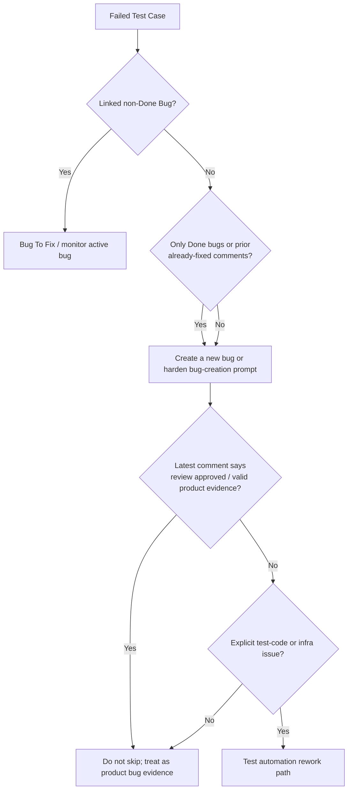

# TrackState DF Manager Watchlist

Injected via `.dmtools/config.js → additionalInstructions` for the shared
`df_manager` agent. Keep the shared auditor generic; use this file for
TrackState-specific queues, labels, and recovery priorities.

## Primary things to watch

1. **Failed Test Case backlog**
   - `sm_bug_creation_triggered`
   - repeated bug creation on the same ticket
   - tickets that stay in `Failed` after no-op decisions
   - `Failed` tickets with only Done linked bugs and no non-Done bug

2. **PR review/rework churn**
   - open PRs that are clean but not merging
   - review → rework → review loops on the same branch
   - branch updates that never happen after a `behind` result

3. **Accessibility and web safety regressions**
   - repeated a11y failures after browser fixes
   - web-incompatible code sneaking into shared paths

4. **Backpressure / starvation**
   - oldest tickets never leaving the queue
   - one ticket getting processed many times while newer work is ignored
   - active workflow pileups on the same ticket key

## Quality rules

- Prefer fixing the shared agent or shared workflow logic when the same pattern
  repeats on multiple tickets.
- Keep TrackState-only status names, labels, and recovery rules here instead of
  baking them into the shared `agents/` repo.
- When a ticket remains in the source state, do not remove the guard label in a
  way that lets SM re-trigger the same loop.
- Escalate any repeated failure loop to a shared rule change after the first
  safe recovery.

## Repeated TC/Bug loop rule

If the same TC returns to `Failed` after a Done bug, do not let bug creation
suppress it as "already fixed". Done bugs are historical attempts; the next
action must be either a new/linkable non-Done bug with prior attempts listed, or
a specific test-code rework reason.

## Output expectations

When DF Manager finds an issue, the report should say:

- what pattern repeated,
- which ticket(s) were involved,
- whether it is safe to auto-recover,
- what should change in shared logic vs TrackState config.
