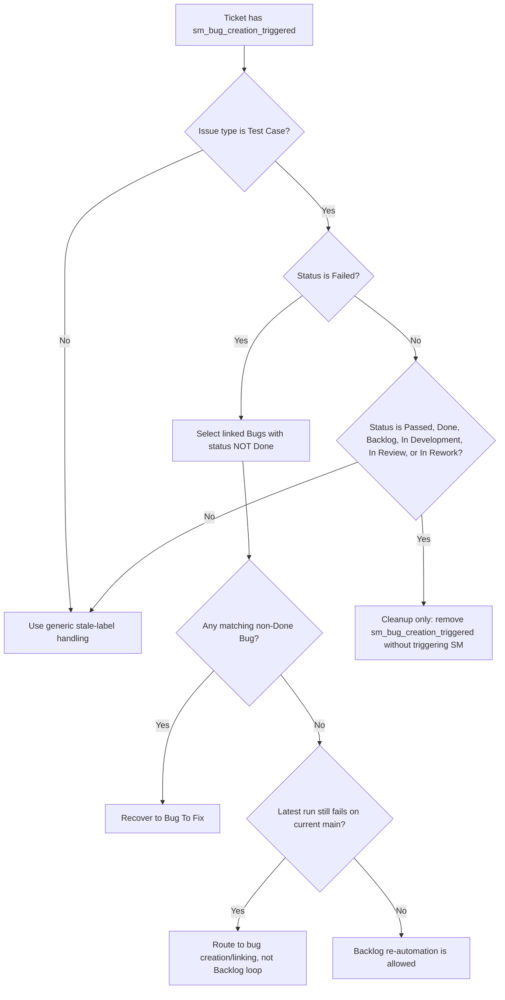
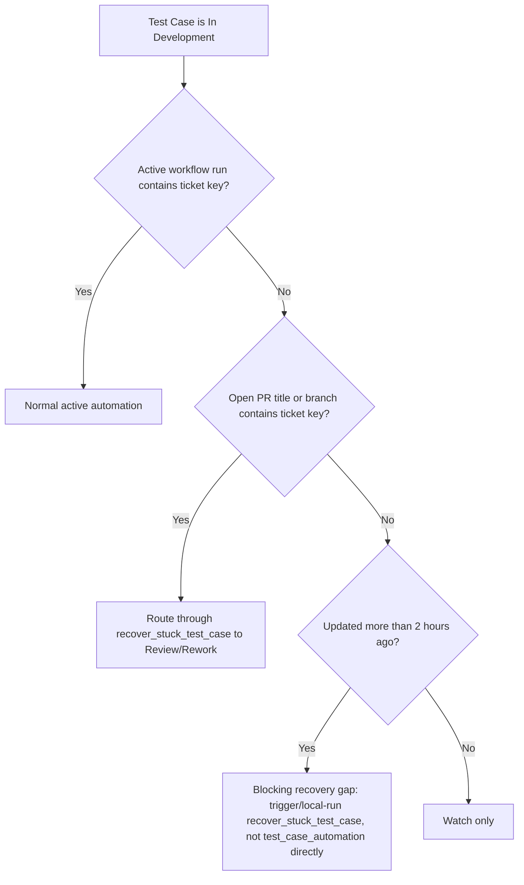

# TrackState DF Manager Watchlist

Injected via `.dmtools/config.js → additionalInstructions` for the shared
`df_manager` agent. Keep the shared auditor generic; use this file for
TrackState-specific queues, labels, and recovery priorities.

## Primary things to watch

1. **Failed Test Case backlog**
   - `sm_bug_creation_triggered`
   - repeated bug creation on the same ticket
   - tickets that stay in `Failed` after no-op decisions

2. **PR review/rework churn**
   - open PRs that are clean but not merging
   - review → rework → review loops on the same branch
   - branch updates that never happen after a `behind` result
   - Test Cases stuck in `In Development` without an active run or open PR

3. **Accessibility and web safety regressions**
   - repeated a11y failures after browser fixes
   - web-incompatible code sneaking into shared paths

4. **Backpressure / starvation**
   - oldest tickets never leaving the queue
   - one ticket getting processed many times while newer work is ignored
   - active workflow pileups on the same ticket key
   - queued GitHub Actions runs older than one hour
   - cached PR list entries that disagree with a direct PR lookup
   - cached workflow-run list entries that disagree with a direct run lookup

## Quality rules

- Prefer fixing the shared agent or shared workflow logic when the same pattern
  repeats on multiple tickets.
- Keep TrackState-only status names, labels, and recovery rules here instead of
  baking them into the shared `agents/` repo.
- When a ticket remains in the source state, do not remove the guard label in a
  way that lets SM re-trigger the same loop.
- Escalate any repeated failure loop to a shared rule change after the first
  safe recovery.

## TrackState recovery decisions

Use this TrackState-specific flow before classifying a stale SM label as
blocking. It prevents old bug-creation guard labels on already resolved test
cases from starving the real queue.

Rules from the diagram:

- `sm_bug_creation_triggered` is a blocking signal only while the Test Case is
  still in `Failed`.
- If the Test Case left `Failed`, treat `sm_bug_creation_triggered` as an
  obsolete cleanup label, even when the generic SM rule map still says the label
  belongs to bug creation.
- Do not trigger `sm.yml` after this cleanup. Re-triggering SM for
  `Passed`/`Backlog` Test Cases can create noise or restart unrelated queues.
- If both `sm_bug_creation_triggered` and `sm_bulk_bugs_creation_triggered` are
  present outside `Failed`, remove both as cleanup labels.
- For Failed Test Case recovery, ignore linked Bugs in `Done` when building the
  active matching Bug set. Done Bugs are historical context only.
- If a Failed Test Case has a matching non-Done Bug, route through
  `recover_failed_tc_bug_status` first; do not run `bug_creation`.
- If all linked Bugs are `Done` or there are no matching non-Done Bugs, and the
  latest Test Case run says the failure still reproduces on current `main`, do
  not send the Test Case into a blind Backlog re-automation loop. Treat it as
  current bug triage and create or link a non-Done Bug.
- A test review comment that explicitly calls the failed run a valid product
  failure is also current failure evidence. Do not override it with `fixedByBug`
  just because historical linked Bugs are Done.

Use this flow for Test Cases that stay in `In Development`:

Rules from the diagram:

- A Test Case in `In Development` with no active run and no open PR is a
  recovery gap after two hours.
- Do not create Bugs for this state; it is automation recovery, not product
  failure.
- Prefer the existing `recover_stuck_test_case` local path. It can route to
  `Backlog`, `In Review - Passed`, or `In Rework` based on PR state.
- If the ticket has no `sm_test_automation_triggered` label and no PR, report it
  as stale work even though the normal SM label detector will not see it.

## Current watch notes

- `Failed` Test Case count should stay at zero or drain quickly.
- Open Bug count should stay at zero or move through `Backlog` →
  `In Development` → `In Review` without aging past one SM cycle.
- Test Cases in `In Development` should either have an active run, an open PR,
  or be younger than two hours.
- Old `sm_bug_creation_triggered` labels on `Passed` or `Backlog` Test Cases are
  cleanup debt, not agent failure. Report their count separately from blocking
  anomalies.
- If `github_list_prs` reports an old PR as open, verify it with
  `github_get_pr` before treating it as blocking. A direct PR lookup is the
  source of truth when list output looks cached or stale.
- If `github_list_workflow_runs` reports an old run as `in_progress`, verify it
  with `github_get_workflow_run` before treating it as active. A direct run
  lookup is the source of truth when list output disagrees with Jira state or
  recent completed-run history.
- GitHub Actions runs queued for more than one hour are infrastructure
  backpressure. Report them separately from agent logic failures and do not
  modify Jira tickets because of those queued runs alone.

## Output expectations

When DF Manager finds an issue, the report should say:

- what pattern repeated,
- which ticket(s) were involved,
- whether it is safe to auto-recover,
- what should change in shared logic vs TrackState config.
