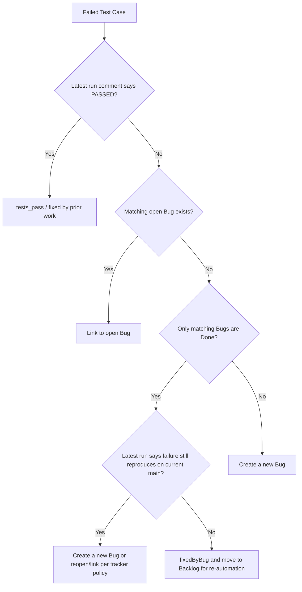

# TrackState Failed Test Case Bug Triage

Injected into bug creation flows for TrackState. Use the latest Test Case run
evidence as the source of truth.

## Done bug matching rule

Rules:

- A Done Bug is not proof that the current Test Case failure is fixed. The
  latest run comment wins.
- If the latest run says the failure still reproduces on `main`, do not classify
  the Test Case as `fixedByBug` just because a historical matching Bug is Done.
- If all matching Bugs are Done and the latest run still fails, create a new Bug
  describing the current regression unless tracker policy explicitly supports
  reopening the Done Bug.
- Do not move this Test Case back to `Backlog` for blind re-automation in that
  case; that creates a Failed -> Backlog -> automation -> Failed loop.
- Use `fixedByBug` only when the latest run is passing, stale, inconclusive, or
  clearly older than the Done Bug fix. If the latest run contains current
  failure evidence, create/link a Bug instead.
- A PR/test review comment that says the failed run is a valid product failure
  is current failure evidence. Treat it the same as the test automation failure
  comment.

## Example patterns

When a latest run comment says:

- linked bugs for the scenario are Done, and
- the current `main` run still reproduces the failure,

the correct decision is Bug creation/linking, not `fixedByBug`.

When a test review says:

- the latest FAILED run is a valid product failure, and
- not a test defect,

the correct decision is also Bug creation/linking, even if historical linked
Bugs are Done.

Concrete TrackState examples observed in monitoring:

- `TS-715`: latest run failed hosted workspace sync backoff timing on current
  `main`; all linked Bugs were Done; correct action is to create/reopen/link a
  Bug for the current backoff regression, not move the Test Case to Backlog.
- `TS-893`: PR review approved the test and explicitly said the current FAILED
  execution is a valid product-visible restore failure; correct action is
  Bug creation/linking, even when many historical restore Bugs are Done.
- `TS-732` / `TS-887`: latest run or review evidence said the product failure
  still reproduces; historical Done Bugs must not suppress Bug creation.
