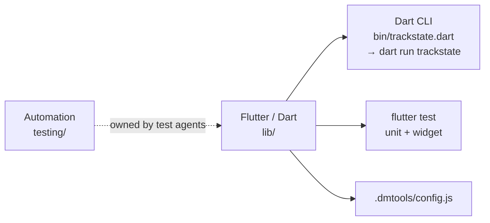
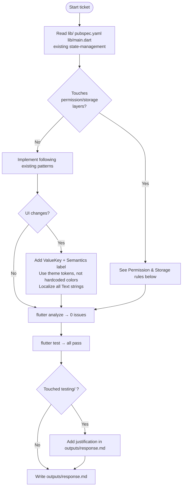
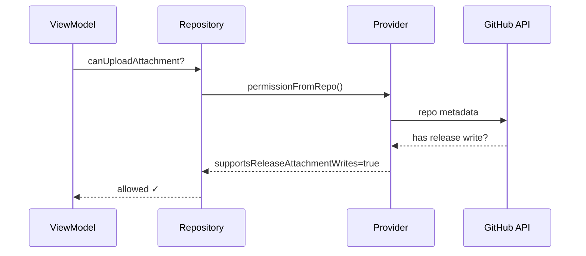
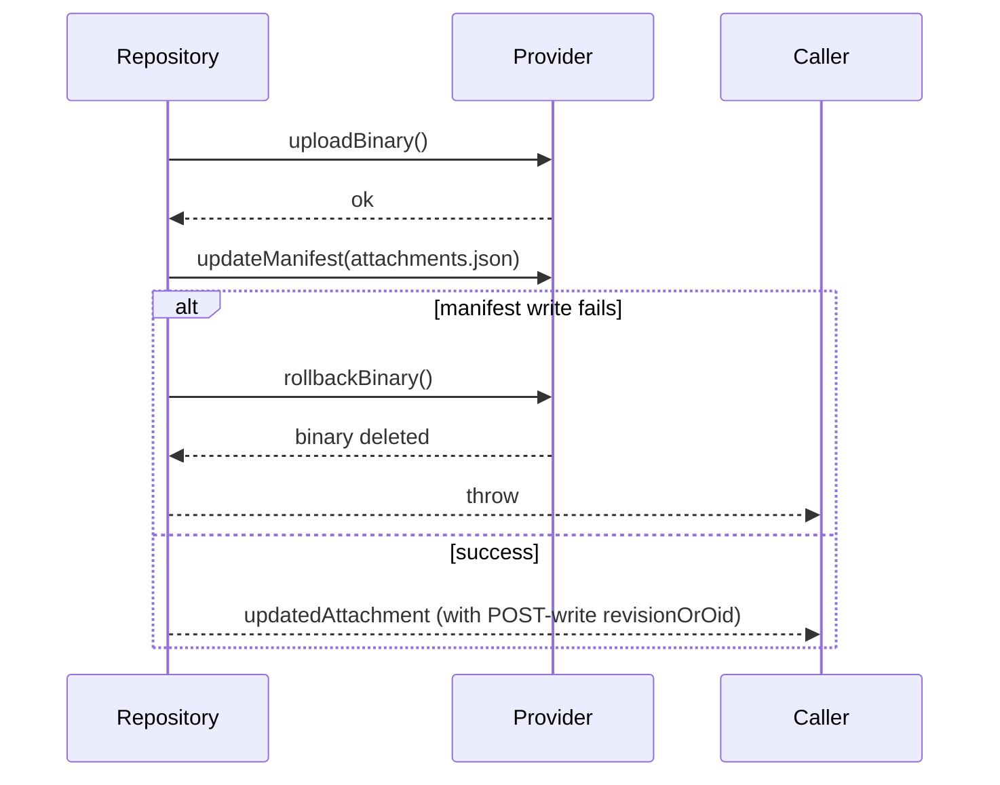

# TrackState Flutter Development Rules

Injected via `.dmtools/config.js → additionalInstructions`. The shared `agents/` submodule stays project-independent.

## Stack



## Implementation flow



## Permission & Storage implementation rules

These patterns caused the most BLOCKING review cycles. **Read before touching provider/repository/permission code.**

### 1 — Wire capabilities end-to-end through the provider

Never hard-code a capability flag to `false` in `_permissionFromRepoJson()` or similar. Every new feature capability (e.g. `supportsReleaseAttachmentWrites`) must be:
- Detected in the provider from actual API data
- Exposed in the permission/session model
- Checked in the repository gate before performing the operation



### 2 — Storage-aware permission gates

When multiple storage backends exist (local-git, GitHub Releases, etc.), each gate must check the **configured** storage mode, not a generic permission:

```
// ❌ WRONG — generic permission, ignores storage mode
if (!permission.canManageAttachments) throw ...

// ✅ CORRECT — storage-mode-aware gate
if (storageMode == AttachmentStorageMode.githubReleases) {
  if (!permission.supportsReleaseAttachmentWrites) throw ...
} else {
  if (!permission.canManageAttachments) throw ...
}
```

### 3 — Atomic write ordering (upload → metadata)

When implementing two-step writes (binary + JSON manifest):



**Never** return a stale `revisionOrOid` computed before the write. Always re-read or refresh the revision after `applyFileChanges`.

### 4 — Download via authenticated asset API, not browser_download_url

For private/hosted GitHub repos, `browser_download_url` requires browser redirect and fails for programmatic access. Use:
```
GET /repos/{owner}/{repo}/releases/assets/{asset_id}
```
with `Accept: application/octet-stream` and authenticated token.

### 5 — UI state must respect hostedRepositoryAccessMode

Callout tone/messaging must branch on `hostedRepositoryAccessMode`:
- `writable` → supported/success state
- `readOnly` | `disconnected` → restricted/warning state

Never collapse `readOnly` and `disconnected` into the same "supported" branch.

### 6 — In-memory validation scaffolding must not persist to disk

Synthetic or fallback fields injected for validation (e.g. reserved built-in fields) must be stripped before `saveProjectSettings()` serializes to `config/fields.json`. Keep fallback logic in validation; do not let it reach the persistence layer.

### 7 — Cover all entry points, not just the first one found

When fixing a rendering/display bug (e.g. locale label fallback), check **all** surfaces where the same data is displayed:
- Search results list
- Board column headers
- Issue detail view
- Settings editor

Add a test for each surface you fix.

## General development rules

| # | Rule |
|---|------|
| 1 | Read `lib/`, `pubspec.yaml`, `lib/main.dart`, existing patterns before writing code |
| 2 | Add packages via `flutter pub add`, never hand-edit `pubspec.yaml` |
| 3 | `ValueKey` (kebab-case) on every user-facing or automation-targeted widget |
| 4 | `Semantics(label:...)` on every `IconButton`, `GestureDetector`, custom interactive widget |
| 5 | Theme tokens only — no hardcoded `Color(0xFF...)` or pixel sizes |
| 6 | All `Text()` content must go through the localization system |
| 7 | For CLI: validate `--path`, run from repo root, keep JSON response schema stable |
| 8 | Do not touch `testing/` unless ticket requires it; justify in `outputs/response.md` |
| 9 | `flutter analyze` → 0 issues; `flutter test` → all pass before finishing |
| 10 | Null safety: no `dynamic`, no unjustified `!` |

## Bug-fix additional rules

- Ticket returned to dev → read prior Jira comments + previous PR diffs before changing anything
- CLI bug → test both happy path and exact error path from ticket
- Check `git log --oneline lib/ | head -20` before fixing to see recent changes to the same files

## Output (`outputs/response.md`)

Must include: issues/notes · approach · files modified · test coverage · `flutter analyze` + `flutter test` result
