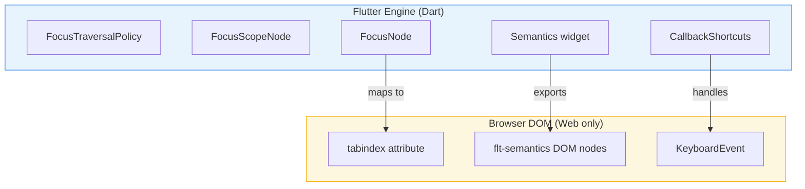
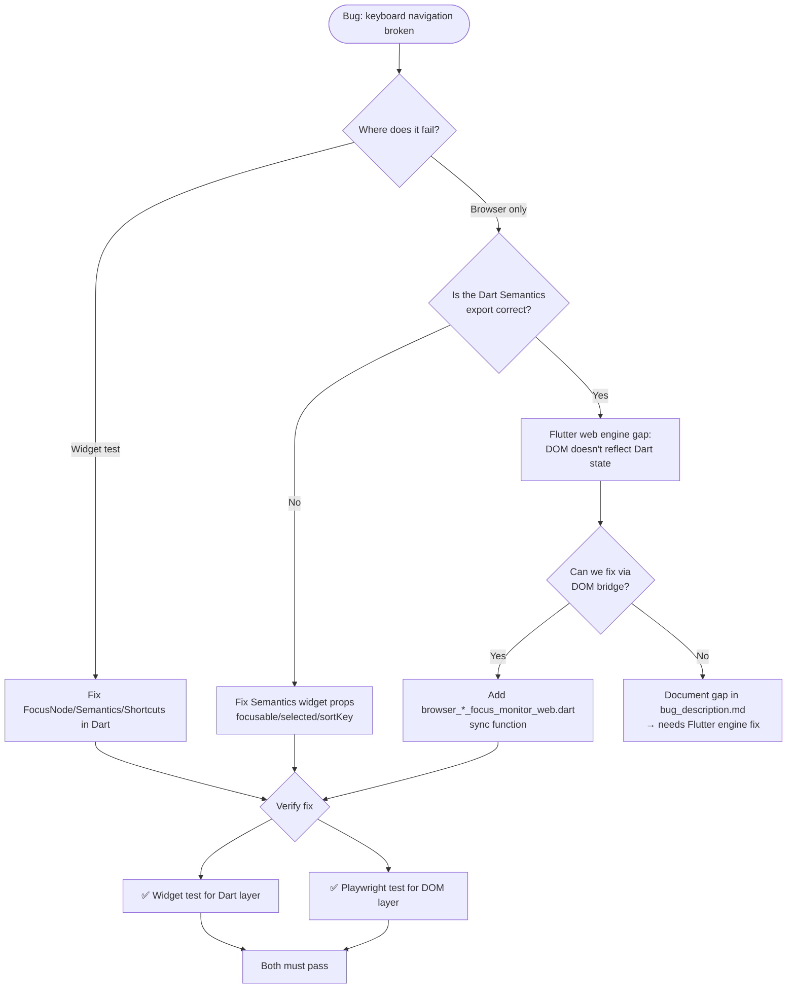
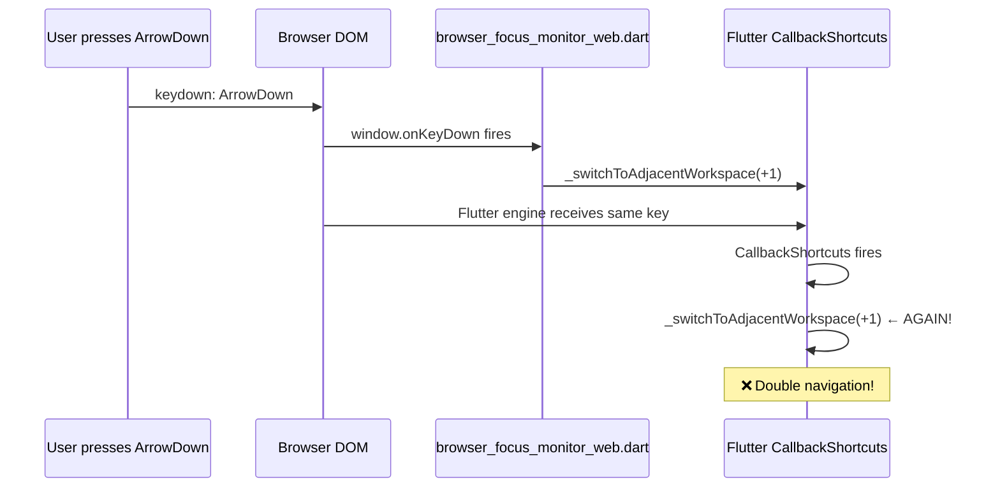
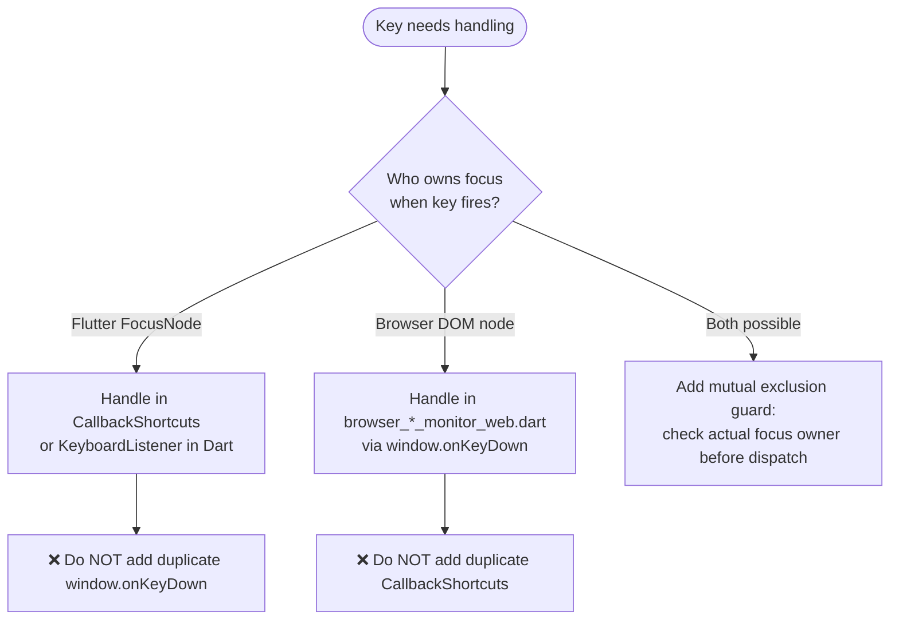
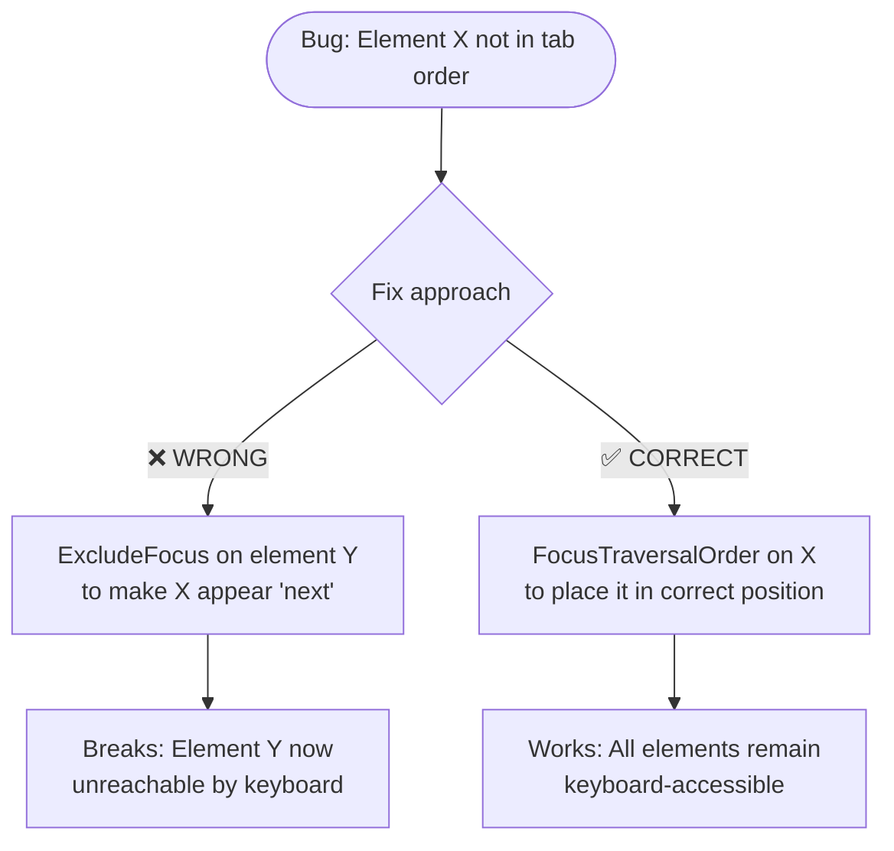
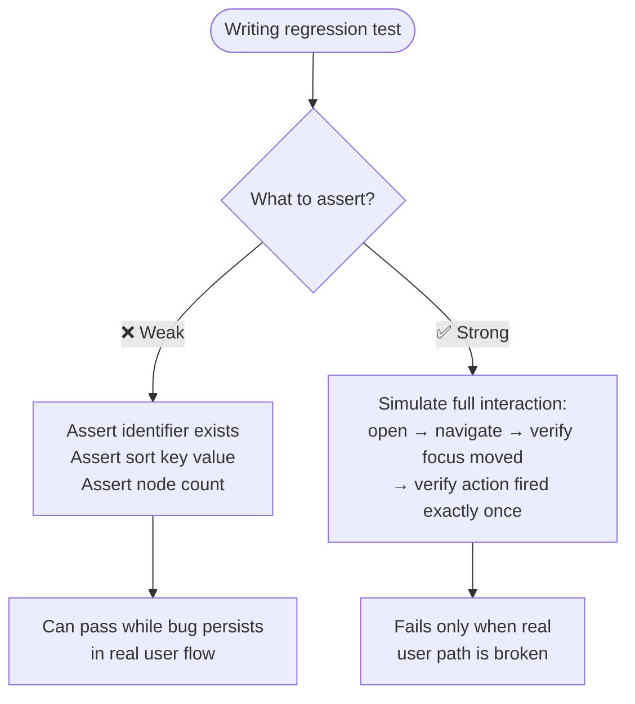
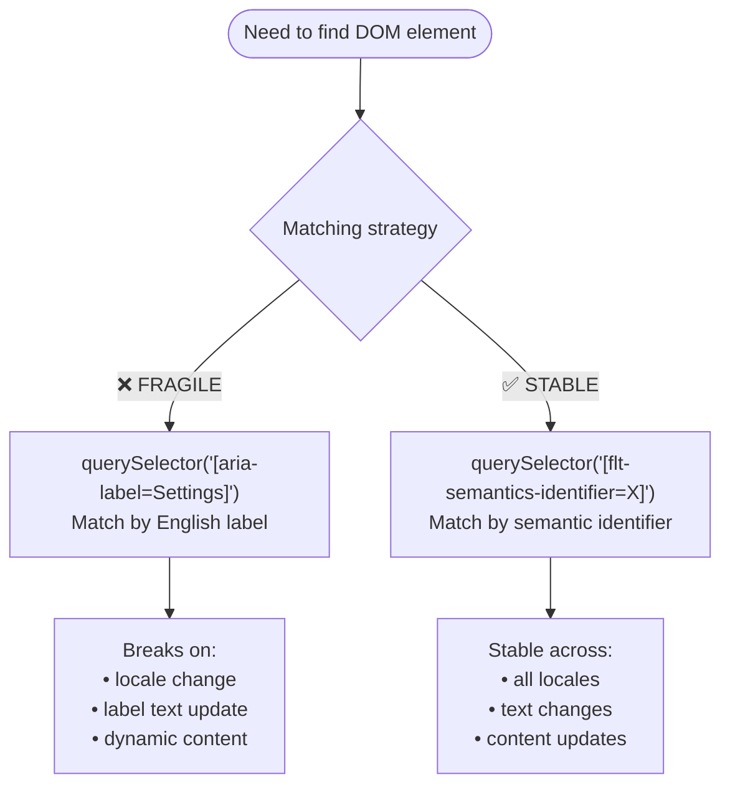
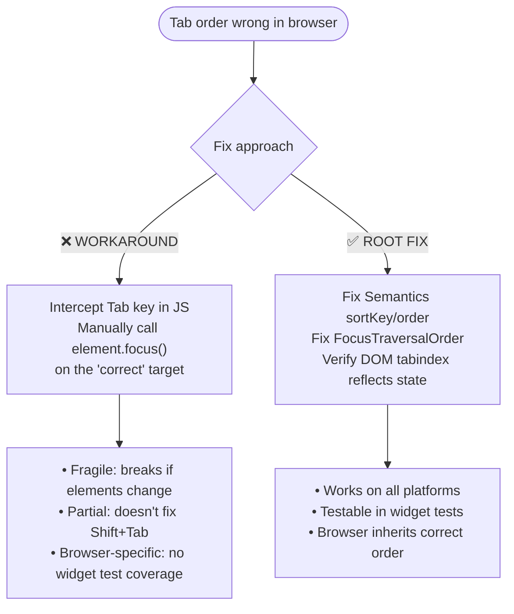
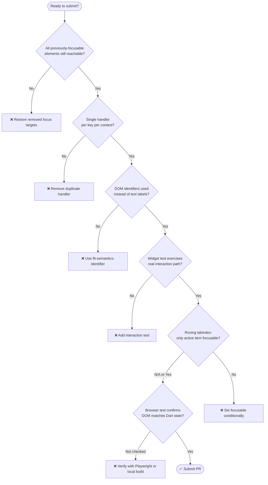
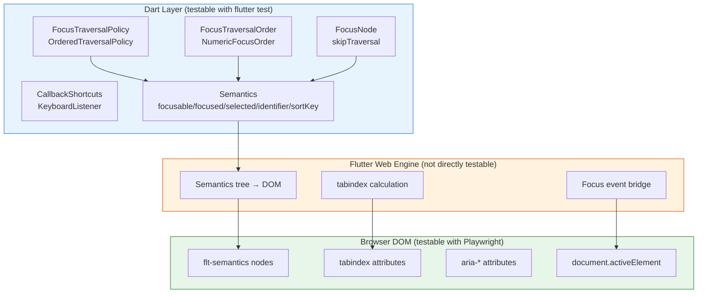

# Flutter Web Focus & Keyboard Navigation Rules

Injected via `.dmtools/config.js → additionalInstructions`. Addresses recurring BLOCKING review issues in keyboard/focus/accessibility PRs.

## Architecture — Flutter focus vs Browser DOM focus



**Critical insight**: Flutter widget tests exercise the `Flutter Engine` layer only. The `Browser DOM` layer can diverge. A widget test passing does NOT prove the browser keyboard path works.

## Decision tree — Fixing a keyboard/focus bug



## Anti-pattern #1 — Duplicate event handlers (racing)

**Problem**: Adding a browser-level `window.onKeyDown` handler for a key that Flutter already handles via `CallbackShortcuts` or `KeyboardListener`.



### Rule: One handler per key per context



**Implementation pattern:**
```dart
// ✅ CORRECT — single handler with context check
void _handleBrowserKeyDown(html.KeyboardEvent event) {
  if (!isBrowserFocusOnWorkspaceSwitcherRow()) return; // guard
  if (event.key == 'ArrowDown') {
    event.preventDefault();
    _switchToAdjacentWorkspace(1);
  }
}

// ❌ WRONG — browser handler + Flutter CallbackShortcuts both handle ArrowDown
// This causes double-fire when focus transitions between layers
```

## Anti-pattern #2 — Fixing focus order by removing other elements

**Problem**: Using `ExcludeFocus`, `skipTraversal: true`, or `canRequestFocus: false` on visible interactive elements to "fix" the order of a different element.



### Rule: Never remove keyboard access from visible interactive elements

Before submitting a focus-order fix, verify:
1. **All previously-focusable elements** in the same area are still keyboard-reachable
2. **The fix adds/reorders**, never removes, focus targets
3. **Check adjacent controls**: theme toggle, sync pill, CTAs, search — all must stay in tab order

```dart
// ❌ WRONG — hides theme toggle from keyboard to "fix" switcher position
ExcludeFocus(child: themeToggleButton)

// ✅ CORRECT — explicit ordering keeps all elements reachable
FocusTraversalOrder(
  order: NumericFocusOrder(3.0),
  child: themeToggleButton,
)
```

## Anti-pattern #3 — Widget test covers metadata, not interaction

**Problem**: Test checks that semantics identifiers/sort keys exist, but doesn't exercise the actual user interaction that fails.



### Rule: Test the user contract, not the implementation metadata

```dart
// ❌ WEAK — proves identifiers exist, not that interaction works
expect(find.bySemanticsLabel('workspace-row-0'), findsOneWidget);
expect(find.bySemanticsLabel('workspace-row-1'), findsOneWidget);

// ✅ STRONG — proves the actual navigation contract
await tester.sendKeyEvent(LogicalKeyboardKey.arrowDown);
await tester.pump();
// Verify: focus moved to next row
expect(focusedRow, equals(1));
// Verify: navigation fired exactly once
expect(switchCount, equals(1));
// Verify: previous row is no longer focusable via Tab
final prevRowSemantics = ...; // get semantics of row 0
expect(prevRowSemantics.isFocusable, isFalse);
```

## Anti-pattern #4 — Hard-coded English labels in DOM matching

**Problem**: Browser focus monitor code matches DOM nodes by visible text labels instead of stable semantic identifiers.



### Rule: Always use `flt-semantics-identifier` for DOM matching

```dart
// ❌ WRONG — breaks on locale change
final el = document.querySelector('[aria-label="Settings"]');
final els = document.querySelectorAll('[aria-label*="Workspace switcher"]');

// ✅ CORRECT — stable identifiers set via Semantics(identifier: ...)
final el = document.querySelector('[flt-semantics-identifier="settings-button"]');
final els = document.querySelectorAll('[flt-semantics-identifier^="workspace-row-"]');
```

## Anti-pattern #5 — Roving tabindex not fully implemented

**Problem**: Setting `Semantics(focusable: true)` on all list items instead of only the active one, breaking the roving tabindex pattern.

```mermaid
flowchart TD
  Pattern([Roving tabindex pattern]) --> Active{Is this the<br/>active/selected item?}
  Active -->|Yes| Tab0["Semantics(focusable: true)<br/>→ tabindex='0' in DOM<br/>+ focused: true, selected: true"]
  Active -->|No| TabN1["Semantics(focusable: false)<br/>→ tabindex='-1' in DOM<br/>+ focused: false, selected: false"]

  Tab0 --> FocusNode["FocusNode(skipTraversal: false)"]
  TabN1 --> SkipNode["FocusNode(skipTraversal: true)"]

  FocusNode --> Sync[Call syncBrowserTabIndices()<br/>after state change]
  SkipNode --> Sync
```

### Rule: Conditional focusable based on active state + DOM sync

```dart
// In _WorkspaceSwitcherRowState:
Semantics(
  identifier: '${workspaceRowIdentifierPrefix}${widget.workspace.name}',
  focusable: widget.isActive,    // ← CONDITIONAL
  focused: widget.isActive,
  selected: widget.isActive,
  child: ...
)

// Focus node:
FocusNode(skipTraversal: !widget.isActive)

// After every selection change:
syncBrowserWorkspaceSwitcherRowTabIndices(); // DOM may lag behind Dart state
```

## Anti-pattern #6 — Browser focus workaround instead of root fix

**Problem**: Intercepting `Tab` key to manually move focus instead of fixing the actual focus export order.



### Rule: Fix the source (Dart Semantics/Focus), not the symptom (DOM focus)

Only use browser-side focus manipulation (`element.focus()`, tabindex sync) as a **supplement** when Flutter web engine doesn't correctly export Dart state to DOM. Never as the primary fix.

## Checklist before submitting a keyboard/focus PR



## Flutter web focus layers — reference



**Key gap**: The Engine layer sometimes doesn't update `tabindex` attributes after Dart `Semantics` changes. This is why `syncBrowserWorkspaceSwitcherRowTabIndices()` exists — it manually corrects DOM state when the engine lags.

## Summary of rules

| # | Rule | Triggered by |
|---|------|-------------|
| 1 | One key handler per context — never duplicate browser + Flutter handlers | PR #815 double ArrowDown |
| 2 | Never remove focus from visible interactive elements to fix order of others | PR #818 ExcludeFocus on theme toggle |
| 3 | Test the user interaction contract, not just semantics metadata | PR #815, #826 weak tests |
| 4 | Use `flt-semantics-identifier`, never English text labels, for DOM matching | PR #826 hard-coded labels |
| 5 | Roving tabindex: `focusable` must be conditional on active state | PR #827 (our fix for TS-870) |
| 6 | Fix focus order at the Dart Semantics source, not via Tab interception | PR #826 Tab interceptor |
| 7 | After any Semantics state change, call DOM sync for web platform | Engine lag gap |
| 8 | Widget test + Playwright test = complete coverage for keyboard bugs | Widget alone is insufficient |
