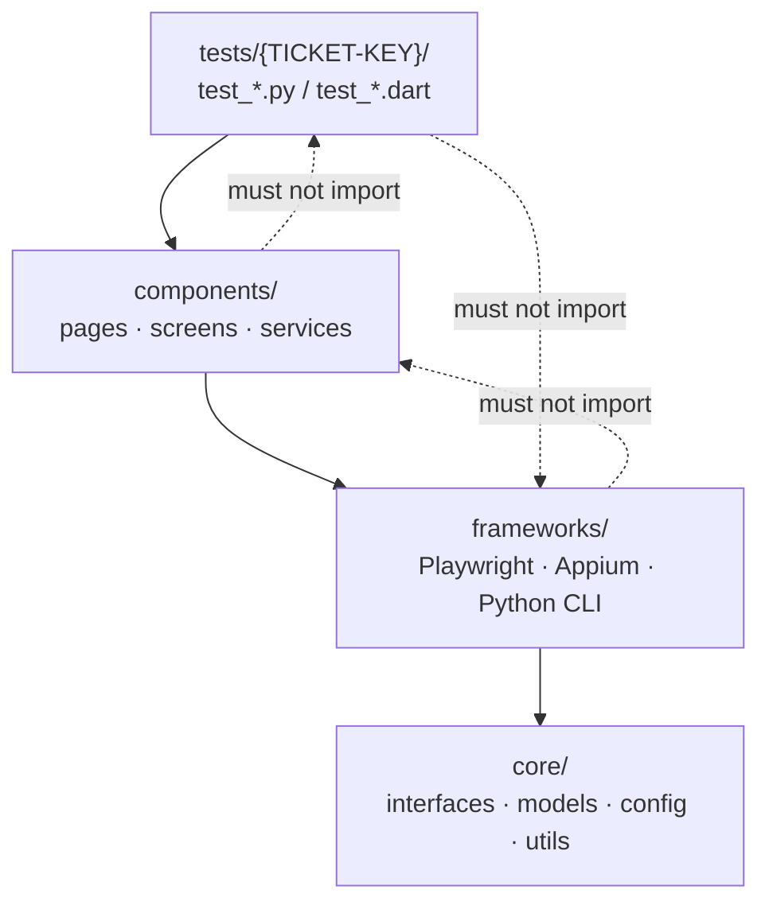
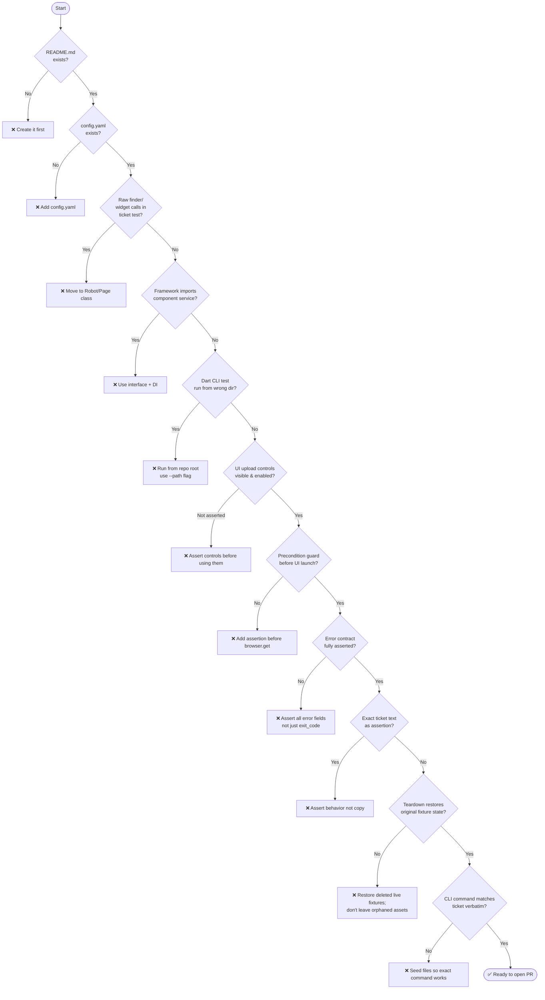
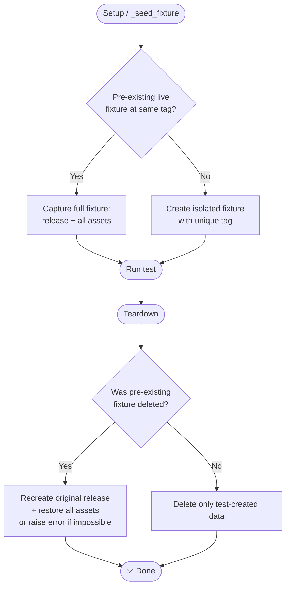

# TrackState Test Automation Hardening Rules

Injected via `.dmtools/config.js → additionalInstructions`. The shared `agents/` submodule stays project-independent.

## Architecture — required layer order



## Pre-submission checklist (verify ALL before opening PR)



## Rule reference

| # | Rule | Common mistake |
|---|------|---------------|
| 1 | `README.md` before test code | Missing beside `config.yaml` |
| 2 | No raw Flutter/widget locators in ticket test | `find.widgetWithText` directly in `test_ts_XXX.dart` |
| 3 | Frameworks never import component services | `from testing.components.services.X import X` inside framework file |
| 4 | Shared helpers in neutral base class | Inheriting unrelated framework for its helpers |
| 5 | Dart CLI: run from repo root, `--path` for target | `cwd=/tmp/empty` breaks package resolution |
| 6 | Assert UI controls visible+enabled **before** using them | `choose_button_count` recorded but step passes when count=0 |
| 7 | Precondition guard before UI | No `assert len(attachments) >= 2` before `driver.get()` |
| 8 | Assert full error contract | Only `exit_code` checked, `error.exitCode` ignored |
| 9 | No exact ticket example strings | `find.text('Add a comment...')` verbatim |
| 10 | Teardown fully restores pre-existing fixtures | Original release deleted in setup, never recreated in teardown |
| 11 | Verbatim CLI command from ticket | Files seeded at `files/` subdir instead of repo root |

## Teardown & fixture isolation rules



Key rules:
- **Never delete a live fixture** unless you capture it fully and can restore it exactly.
- Prefer an **isolated tag** (e.g. `test-ts-XXX-teardown`) that does not collide with seeded data.
- If teardown cannot restore original state, the test must fail loudly rather than leave the repo in a broken state.
- Teardown must cover ALL paths the test may create, including paths that "should not exist" on the success path.

When a test step records multiple matching elements, scope subsequent clicks to the **specific container** validated in the previous step — do not rely on a rightmost/last match across the whole page:

```python
# ❌ WRONG — clicks rightmost matching button on whole page
button = page.get_by_text("Open settings").last

# ✅ CORRECT — scoped to the gate callout validated in Step 3
button = gate_callout.get_by_role("button", name="Open settings")
```

## Review patterns to avoid

- Missing `README.md` beside `config.yaml`
- Ticket test directly using Flutter locators instead of a Robot
- Framework code depending upward on component services
- Ambiguous product failures caused by missing live fixture data
- Tests passing after only the process exit code is fixed while JSON error fields stay wrong
- Cleanup that leaves attachments/comments/files behind after unexpected product success
- Asserting exact UI copy that the ticket only uses as an example
