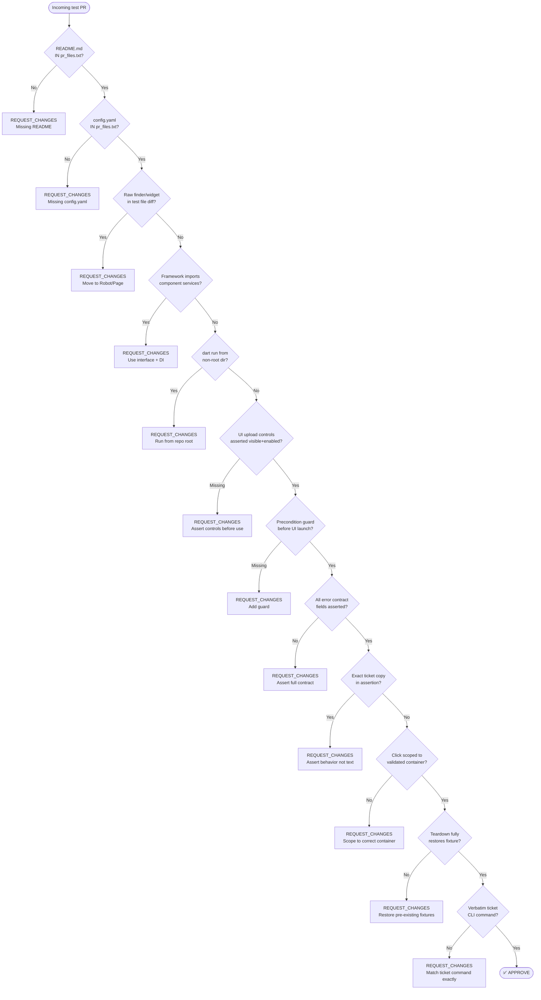

# TrackState Test Automation Review Checklist

For TrackState test automation PRs, verify every item in one review pass before deciding the recommendation.

## Quick decision flow

## Checklist table

| # | Check | File to inspect |
|---|-------|----------------|
| 1 | `testing/tests/{TICKET-KEY}/README.md` exists | `pr_files.txt` |
| 2 | `testing/tests/{TICKET-KEY}/config.yaml` exists | `pr_files.txt` |
| 3 | No raw `find.*`, `WidgetTester`, `tester.tap()` in ticket test file | `pr_diff.txt` under `testing/tests/` |
| 4 | No `testing/components/services/` import inside `testing/frameworks/` | `pr_diff.txt` imports |
| 5 | Shared helpers use neutral base class, not unrelated inheritance | `pr_diff.txt` class definitions |
| 6 | Dart CLI tests: `cwd` is repo root, target passed via `--path` | `pr_diff.txt` subprocess calls |
| 7 | UI upload/action controls explicitly asserted visible+enabled before use; step fails if count=0 | `pr_diff.txt` |
| 8 | Precondition assertion before `driver.get()` / browser launch | `pr_diff.txt` |
| 9 | Error assertions cover all contract fields (not only `exit_code`) | `pr_diff.txt` assert blocks |
| 10 | No exact ticket example strings as assertion values | `pr_diff.txt` `find.text()` / `assert x == '...'` |
| 11 | Click targets scoped to validated container (not rightmost page match) | `pr_diff.txt` page object methods |
| 12 | Teardown fully restores pre-existing live fixtures; isolated tag for test data | `pr_diff.txt` teardown methods |
| 13 | CLI command matches ticket verbatim; files seeded at expected locations | `pr_diff.txt` subprocess args |

**If any item fails → REQUEST_CHANGES with an inline comment on the relevant diff line.**
**Search the entire diff for ALL occurrences of the same pattern before posting the review.**
