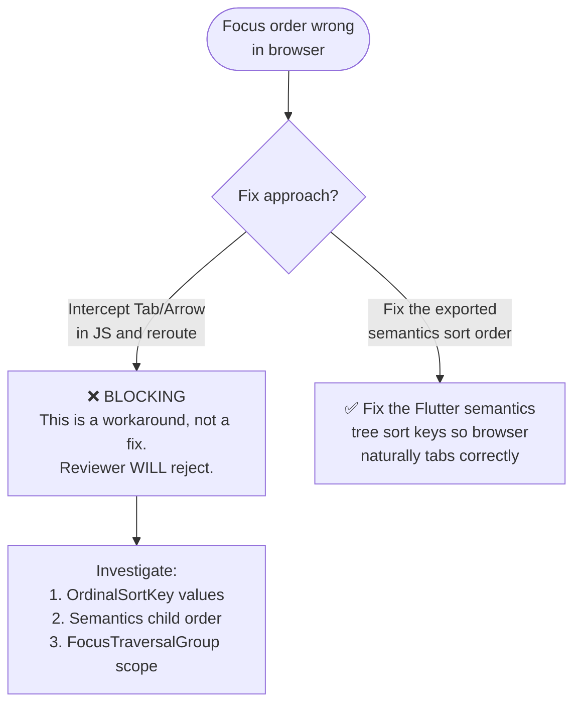
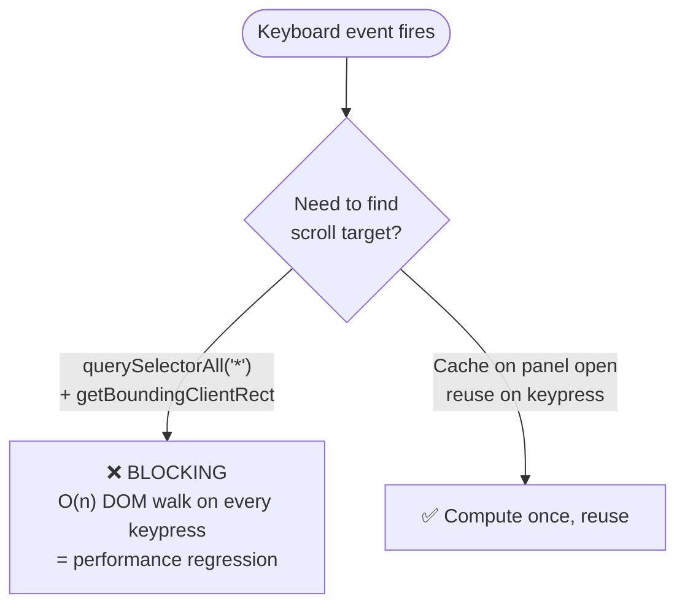

# Bug Development — Critical Anti-Patterns

These patterns caused 6–13 review rework cycles. Read and avoid them.

## 1. Widget test passes ≠ browser works

```mermaid
flowchart TD
  Fix([Implement fix]) --> WT{Widget test\npasses?}
  WT -->|Yes| BT{Does the ticket\nfail in BROWSER\n(Playwright/Chromium)?}
  BT -->|Not tested| WRONG["❌ NEVER assume widget = browser\nFlutter web semantics differ from native focus"]
  BT -->|Still fails| Root["Root cause is in browser layer:\n- Semantics tree export order\n- tabindex synchronization\n- JS interop bridge"]
  BT -->|Passes| OK([✅ Ship])
  WT -->|No| Fix2[Fix the Dart code first]
```

**Rule**: If the ticket mentions browser tab order, focus, or Playwright — a passing widget test alone is NOT sufficient. The browser semantics tree is a separate system.

## 2. Never use DOM-wide workarounds for focus order bugs



**Rule**: Browser focus order comes from the semantics tree export. Fix the source, not the symptom.

## 3. No full-DOM scans on keyboard events



**Rule**: Expensive DOM queries (querySelectorAll, getComputedStyle, getBoundingClientRect) must be cached. Never run per-keypress.

## 4. Mixed-scroll: identify the ACTUAL scroller

When both `window` and a Flutter semantics scroller exist:
- Don't default to `window` — check which element has the relevant `scrollTop`
- Capture BOTH, restore only whichever drifted
- The Flutter semantics scroller often owns the actual content scroll

## 5. Test must prove the TICKET scenario, not a subset

If the ticket says "ArrowDown should advance selection AND not scroll background":
- ❌ Testing only "ArrowDown is classified as prevent-default" — too weak
- ✅ Testing actual scroll position before/after AND selection change

## 6. Read the previous failed PR before starting

```
git log --oneline --all -- 'lib/ui/features/tracker/services/browser_workspace*' | head -10
```

Check what was already tried. Don't repeat the same approach the reviewer already rejected.
