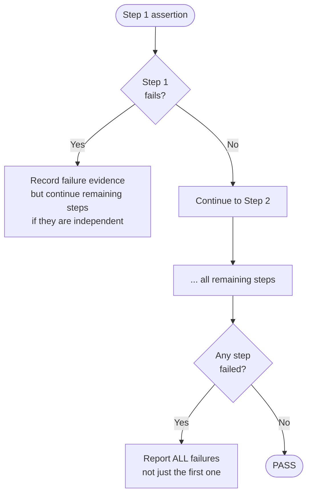
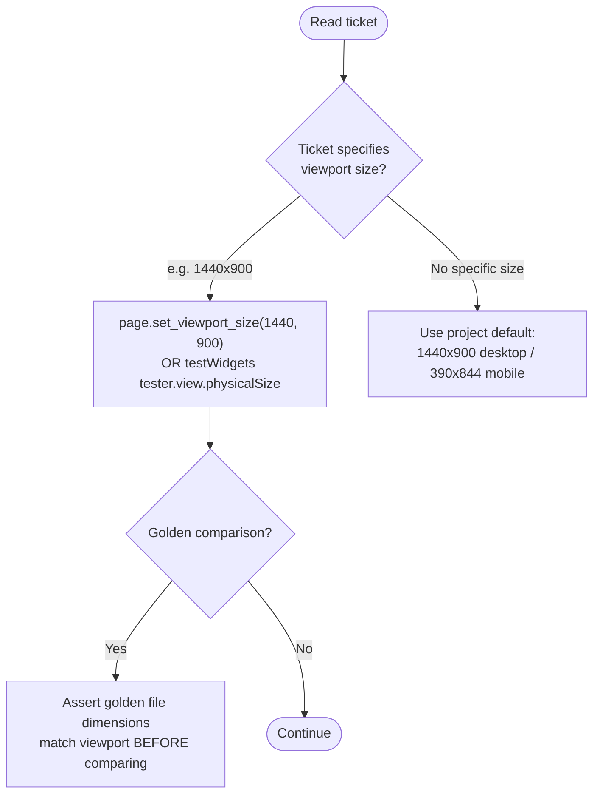
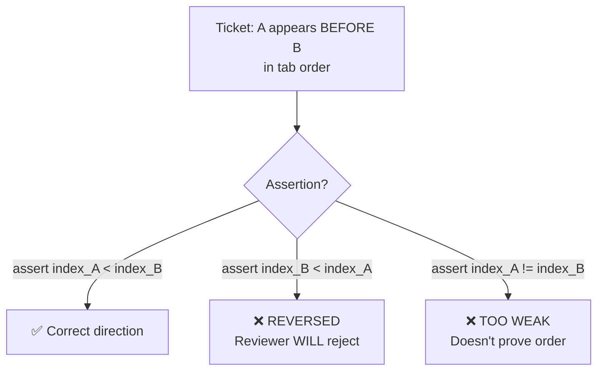
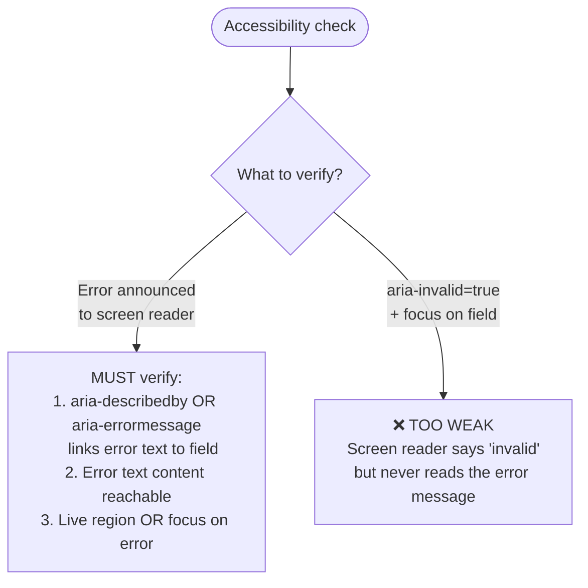
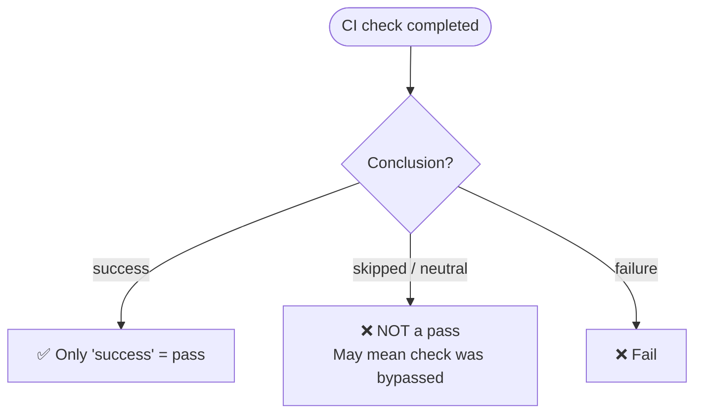
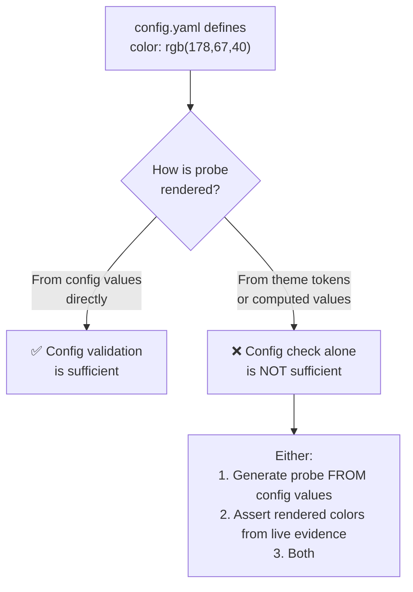
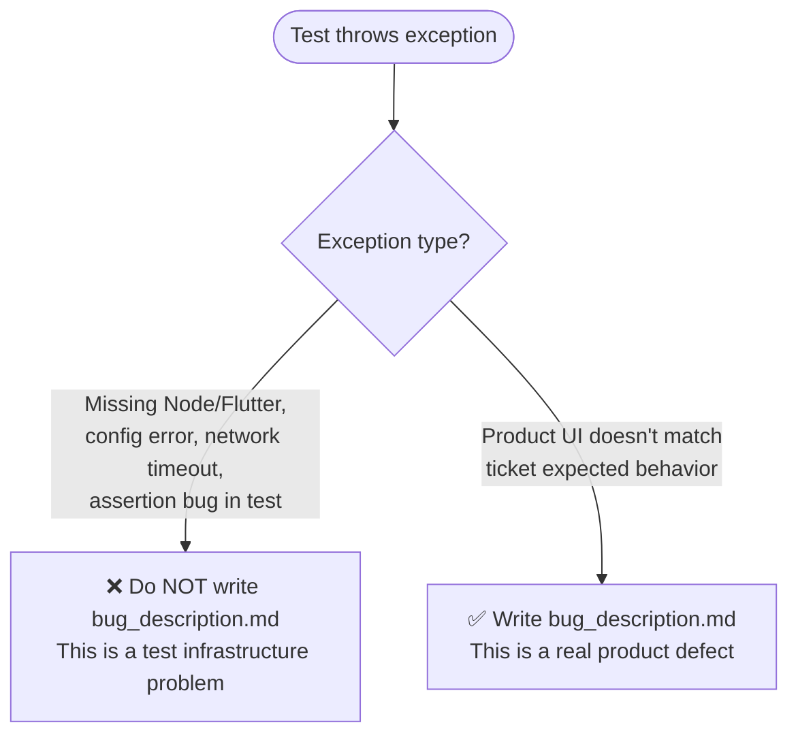

# Test Automation — Critical Anti-Patterns

These patterns caused 8–13 review rework cycles. Read and avoid them.

## 1. Never hard-stop on an early step



**Rule**: If Step 1 fails but Steps 2–5 are independent, execute all of them. Report the full picture. The reviewer needs to see if it's one bug or five.

**Exception**: If a step creates preconditions for the next (e.g., "open panel" before "click button inside"), hard-stop is acceptable.

## 2. Viewport must match the ticket EXACTLY



**Rule**: If the golden file is 1440x960 but ticket says 1440x900, the golden is STALE. Fail fast with an actionable message, don't silently compare mismatched sizes.

## 3. Assertion direction must match ticket order



**Rule**: Re-read the ticket Expected Result immediately before writing the assertion. Copy the exact order relationship.

## 4. Tab order: require ADJACENCY not just ordering

If ticket says "A is immediately before B":
- ❌ `assert index_a < index_b` — allows gaps (other elements between)
- ✅ `assert index_b == index_a + 1` — proves direct adjacency

## 5. Label matchers must recognize ALL live variants

The production UI may render different label text across runs:
- `"Search issues"`, `"JQL Search"`, `"Search"` — all refer to the same control

```python
# ❌ WRONG — matches only one variant
search = page.get_by_role("button", name="Search issues")

# ✅ CORRECT — matches known variants
search = page.get_by_role("button", name=re.compile(r"Search|JQL Search|Search issues"))
```

**Rule**: Check the ticket history and prior run logs for all observed label variants before writing a matcher.

## 6. Always write pass artifacts on success

Every test MUST produce on success:
- `outputs/test_automation_result.json` with `"status": "passed"`
- `outputs/response.md` with summary
- Remove stale `outputs/bug_description.md` if present

A test that passes silently (no artifacts) will never report success to the pipeline.

## 7. Accessibility assertions must be SPECIFIC



**Rule**: `aria-invalid` alone is never sufficient for "error feedback is accessible". The actual error text must be programmatically associated.

## 8. Regression test fixtures must match data class contracts

When you create a fake/stub observation for regression tests:
- Instantiate the REAL data class, not a dict
- Supply ALL required fields, not just the ones your test cares about
- If the data class gains a new field, ALL fixtures must be updated in the same PR

```python
# ❌ WRONG — missing required fields, test crashes before assertions run
fake_obs = GateObservation(conclusion="success", steps=["Run checks"])

# ✅ CORRECT — all required fields present
fake_obs = GateObservation(
    conclusion="success",
    steps=["Run checks"],
    runtime_surface_present=True,
    runtime_surface_summary="hosts=1; nodes=50"
)
```

**Rule**: Run `python3 -m unittest <regression_test_file>` BEFORE pushing. If it errors with `TypeError: missing required positional argument`, fix it immediately.

## 9. Never treat `skipped`/`neutral` CI conclusion as PASS



**Rule**: If the ticket requires a CI check to prove something, only `conclusion == 'success'` counts. A skipped check proves nothing.

## 10. Config values must be coupled to runtime artifacts



**Rule**: If the test validates config values but the runtime uses a different source (theme tokens, computed values), the assertion proves nothing about actual behavior. Couple the assertion to the runtime artifact.

## 11. bug_description.md only for PRODUCT defects, not setup failures



**Rule**: `bug_description.md` triggers bug creation downstream. Writing it for setup failures creates FALSE bugs that waste the pipeline. Only write it when the product itself is broken.

## 12. Never hardcode expectations that drift with UI changes

```python
# ❌ WRONG — breaks when panel adds/removes controls
assert last_element.text == "Save and switch"

# ✅ CORRECT — derive from live state
all_tabbable = page.query_selector_all('[tabindex="0"], button, input, a')
last_internal = [e for e in all_tabbable if switcher_panel.contains(e)][-1]
```

**Rule**: If the ticket is about "wraps to the LAST internal element", discover what that element IS at runtime. Don't hardcode a label that drifts.

## 13. Swallowing exceptions hides regressions

```python
# ❌ WRONG — hides real failures
try:
    dismiss_banner()
except:
    pass  # "banner is optional"

# ✅ CORRECT — catch only expected cases
try:
    dismiss_banner()
except TimeoutError:
    pass  # Banner not shown in this flow, expected
```

**Rule**: Bare `except` or `except Exception` can mask product regressions. Catch only the specific expected case.
